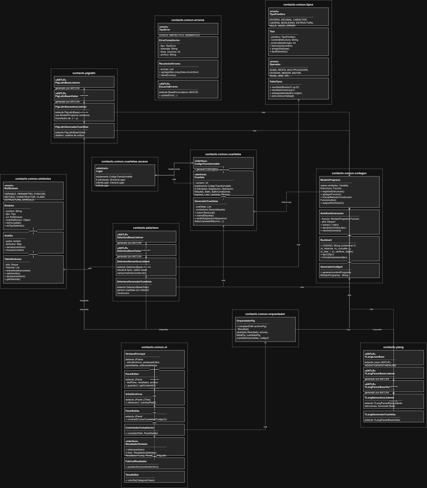

# Proyecto 1: Contacto

## Descripcion

Compilador con interfaz grafica, desarrollado en Java para el curso Organizacion de Lenguajes y Compiladores 2. A diferencia de un simple analizador, este proyecto compila TRES lenguajes fuente distintos -Y?, Zetariano y Pig Latin-, cada uno implementado con ANTLR4, que se validan en sus fases lexica, sintactica y semantica, y que en conjunto generan codigo en lenguaje C real y ejecutable.

Pig Latin es el lenguaje principal de todo programa: importa las clases de Zetariano (orientado a objetos, sintaxis inspirada en Java) y las estructuras/funciones de Y? (sintaxis inspirada en Python, bloques por indentacion) que necesite, y es el unico que se compila de punta a punta hasta obtener un `.c`.

## Caracteristicas

- Analisis lexico, sintactico y semantico con ANTLR4 para los tres lenguajes, con manejo de errores centralizado (indican archivo, linea y columna)
- Sin AST propio: el analisis semantico (patron Listener) y la generacion de codigo (patron Visitor) trabajan directamente sobre el arbol que genera ANTLR
- Sistema de tipos y tabla de simbolos compartidos entre los tres lenguajes, con jerarquia de conversion implicita
- Orquestador multi-archivo: resuelve los `import` de un `.pig` y compila en conjunto los `.z` / `.y` que referencia
- Generacion de codigo de tres direcciones (cuartetas) y traduccion completa a codigo C, verificada compilando con `gcc -Wall -Wextra` sin advertencias
- Interfaz grafica en Java Swing con coloreado de sintaxis en tiempo real para los tres lenguajes, reutilizando el lexer de ANTLR de cada uno (sin librerias externas de resaltado)
- Gestion de archivos: abrir carpeta, nuevo archivo/carpeta, guardar, guardar como, renombrar, eliminar (`.y` / `.z` / `.pig`)
- Consola de salida con errores, cuartetas generadas y codigo C, por cada compilacion

## Requisitos Previos

- **JDK:** Java 21 o superior
- **Maven:** Para la compilacion y gestion de dependencias
- **ANTLR4:** 4.13.2 (gestionado por el plugin antlr4-maven-plugin)
- **Compilador de C:** compatible con C11 (por ejemplo `gcc`), para compilar el codigo generado y obtener un ejecutable
- **Sistema Operativo:** Windows, Linux o macOS

### Formas de compilar el Proyecto

#### Usando Maven

```bash
# Compilar el proyecto (genera los lexers y parsers de los 3 lenguajes con ANTLR4)
mvn clean compile

# Ejecutar la interfaz grafica
java -cp target/classes contacto.comun.ui.VentanaPrincipal

# Ejecutar la interfaz abriendo directamente una carpeta de proyecto
java -cp target/classes contacto.comun.ui.VentanaPrincipal ruta/a/mi/proyecto
```

#### Desde un IDE (NetBeans / IntelliJ)
```bash
# Importar el proyecto como Maven Project
# Ejecutar la clase principal:
contacto.comun.ui.VentanaPrincipal
```

### Formato de los Archivos de Entrada

El sistema acepta archivos `.y` (Y?), `.z` (Zetariano) y `.pig` (Pig Latin, punto de entrada del programa). Ejemplo minimo de un `.pig` que importa una clase y una funcion:

```
import Saludo.z
import utils.y

VARIABILES>
esto persona : novus Saludo("Resistencia");

MAIOR>
persona.saludar();
FINIS
```

## Documentacion

- [ManualDeUsuarioProyecto1Fase1](ManualUsuario_Proyecto1.pdf)
- [ManualTecnicoProyecto1Fase1](ManualTecnico_Proyecto1.pdf)

## Diagrama de Clases (UML)


